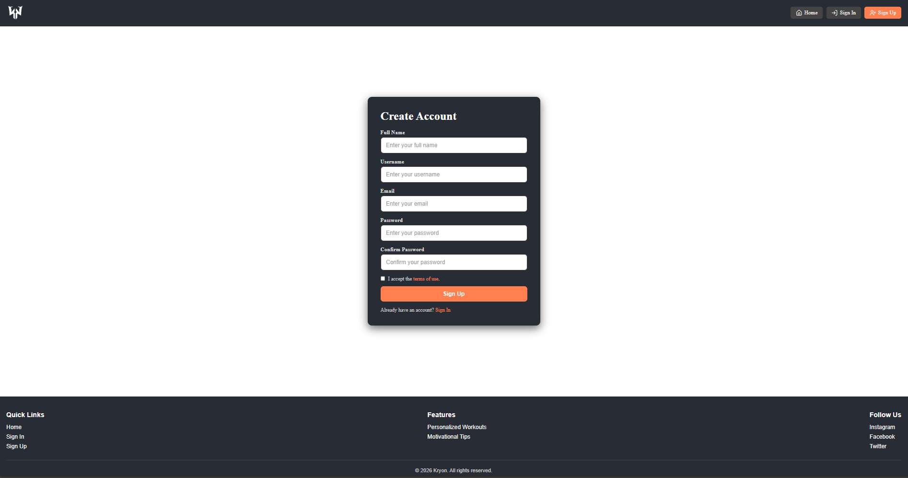
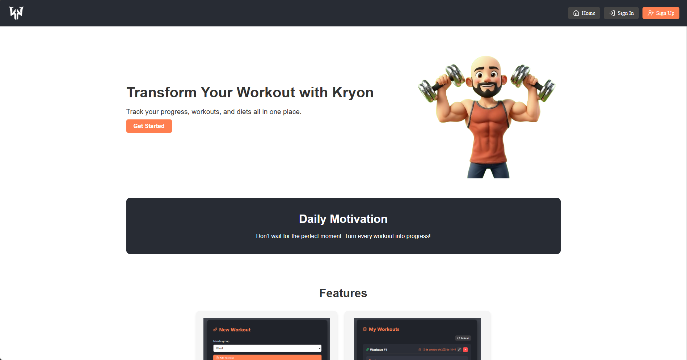
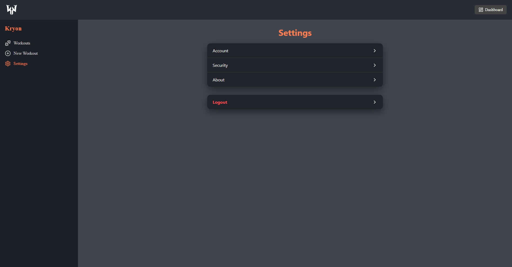
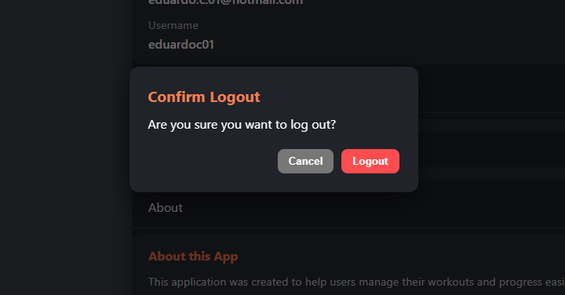

# Kryon

This project is a **Fullstack Web Application** consisting of a backend built with **Node.js + Express + PostgreSQL (Sequelize ORM)** and a frontend developed with **React + Vite**.

---

## Backend Setup

---

### Technologies

- **Node.js + Express**
- **Sequelize ORM**
- **PostgreSQL**
- **JWT Authentication**
- **Bcrypt.js** — Password hashing
- **Nodemailer** — Email service (forgot/reset password)

---

### Requirements

- Node.js v20+
- PostgreSQL 15+

### Installation

```bash
cd backend
npm install
```

### Environment Variables

Create a `.env` file in the `kryon` folder with the following configuration:

```env
DB_NAME=kryon
DB_USER=postgres
DB_PASS=root
DB_HOST=localhost
DB_PORT=5432
API_PORT=3000
JWT_SECRET=root
EMAIL_SERVICE=gmail
SMTP_HOST=smtp.gmail.com
SMTP_PORT=587
EMAIL_USER=your_email@gmail.com
EMAIL_PASS=your_email_password
FRONTEND_URL=http://localhost:5173
BACKEND_URL=http://localhost:3000
```

### Database

Create a PostgreSQL database named `kryon`:

```sql
CREATE DATABASE kryon;
```

### Run API

```bash
cd backend
npm run dev
```
The API will start at **http://localhost:3000**.

## Frontend Setup

---

### Technologies

- **React 19**
- **React Router DOM 7**
- **Axios** — API communication
- **Lucide React** — Modern icons
- **Vite** — Build and dev server
- **PWA** - Progressive Web App

---

### Requirements
- Node.js v20+

### Installation

```bash
cd frontend
npm install
```

### Run the Development Server

```bash
cd frontend
npm run dev
```
The app will start at **http://localhost:5173** by default.

### Main Routes

| Route | Description |
|--------|-------------|
| `/kryon/home` | Home page |
| `/kryon/signin` | User login |
| `/kryon/signup` | Account creation |
| `/kryon/forgot-password` | Password recovery form |
| `/kryon/reset-password` | Password reset page (requires token)|
|`/kryon/activate-account` | Activate account pages (requires token) |
| `/kryon/dashboard` | Protected user dashboard (requires login) |
| `/kryon/dashboard/settings` | Protected user settings (requires login) |
| `/kryon/dashboard/workouts` | Protected user workouts (requires login) |
|`/kryon/dashboard/new` | Protected user create new workouts (requires login) |

## 🖼️ Screens by Route

### `/kryon/signin`
<p align="center">
  
</p>

---

### `/kryon/signup`
<p align="center">
  
</p>

---

### `/kryon/forgot-password`
<p align="center">
  
</p>

---

### `/kryon/reset-password`
<p align="center">
  
</p>

---

### `/kryon/terms-of-use`
<p align="center">
  
</p>

---

### `/kryon/home`
<p align="center">
  
  
</p>

---

### `/kryon/dashboard`
<p align="center">
  
</p>

---

### `/kryon/dashboard/workouts`
<p align="center">
  
</p>

---

### `/kryon/dashboard/workouts/new`
<p align="center">
  
</p>

---

### `/kryon/dashboard/workouts/edit/:id`
<p align="center">
  
</p>

---

### `/kryon/dashboard/settings`
<p align="center">
  
  
</p>

---

### `/kryon/logout`
<p align="center">
  
</p>

---

### Extra Actions

<p align="center">
  
  
</p>

---

---

## Author

**Eduardo Cardoso**  
Developed for academic and learning purposes.

